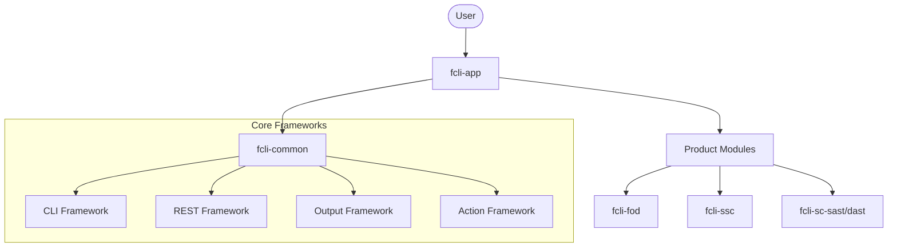

# Project Architecture Blueprint: Fortify CLI (fcli)

This document provides a comprehensive analysis of the architectural patterns, technology stack, and implementation details of the Fortify CLI (`fcli`) tool.

## 1. Technology Stack

*   **Core Language**: Java 17+ (with some Kotlin in build logic).
*   **CLI Framework**: [Picocli](https://picocli.info/) - handles command parsing, help generation, and sub-command discovery.
*   **Build System**: Gradle (Kotlin DSL) - manages a multi-module project structure.
*   **HTTP Client**: [Unirest](https://kong.github.io/unirest-java/) - used for REST API communication.
*   **Native Compilation**: [GraalVM Native Image](https://www.graalvm.org/native-image/) - enables distribution as native binaries for Windows, Linux, and Mac.
*   **Expression Language**: [Spring Expression Language (SpEL)](https://docs.spring.io/spring-framework/docs/current/reference/html/core.html#expressions) - powers dynamic data mapping and transformation in the Action and Output frameworks.
*   **Core Libraries**: Jackson (JSON), Lombok (Boilerplate reduction), Slf4j (Logging).

## 2. Architectural Overview

`fcli` follows a **Modular Plugin-based Architecture**. The core application (`fcli-app`) provides the shell and discovery mechanism, while individual product modules (FoD, SSC, ScanCentral) extend the utility with product-specific commands.

### High-Level Architecture

## 3. Module Structure

The project is organized into several Gradle sub-projects:

| Module | Purpose |
| :--- | :--- |
| `fcli-app` | Main entry point, command tree root, and application runner. |
| `fcli-common` | **Core Architectural Heart**. Contains all base classes, frameworks, and cross-cutting concerns. |
| `fcli-fod` | Fortify on Demand integration. |
| `fcli-ssc` | Software Security Center integration. |
| `fcli-sc-sast` | ScanCentral SAST integration. |
| `fcli-sc-dast` | ScanCentral DAST integration. |
| `fcli-action` | Support for scriptable actions. |
| `fcli-config` | Configuration and variable management. |
| `fcli-util` | Shared technical utilities (MCP, JSON helpers, etc.). |

## 4. Core Frameworks

### 4.1 CLI Framework (Picocli Integration)
`fcli` utilizes Picocli's hierarchical command structure. Commands are typically derived from `AbstractRunnableCommand`. Mixins are heavily used for cross-cutting options like pagination, output format, and REST context.

### 4.2 Output Framework
A metadata-driven system for transforming raw JSON data from REST APIs into user-friendly formats.
*   **Dynamic Mapping**: SpEL is used to extract and transform fields.
*   **Formatters**: Support for Table (Jansi), JSON, CSV, and XML.
*   **AbstractOutputCommand**: Base class for all commands that produce user output.

### 4.3 REST Framework
Built on top of Unirest, it provides a context-aware communication layer.
*   **UnirestContext**: Manages sessions, URLs, and authentication tokens.
*   **Request Producers**: Abstractions for building complex HTTP requests from command parameters.

### 4.4 Action Framework
Allows users to run complex workflows defined in YAML. 
*   **Runner**: Executes a sequence of steps (REST calls, SpEL evaluations, output).
*   **Schema-driven**: Validates action files against a versioned JSON schema.

## 5. Cross-Cutting Concerns

*   **Session Management**: State is maintained in local files (e.g., `~/.fortify/fcli/sessions`) to avoid re-authentication.
*   **Variable System**: Allows passing data between commands using `fcli` variables.
*   **MCP Integration**: Experimental support for Model Context Protocol (MCP) to interact with AI agents.

## 6. Implementation Patterns

### Creating a New Command
1.  Extend `AbstractOutputCommand` or `AbstractRunnableCommand`.
2.  Use `@Command` annotation for CLI metadata.
3.  Inject parameters using `@Option` and `@Parameters`.
4.  Implement `IBaseRequestSupplier` if the command calls a REST API.

---
*Generated: 2026-03-09*
